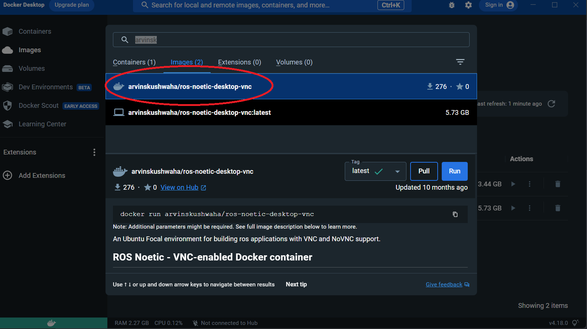
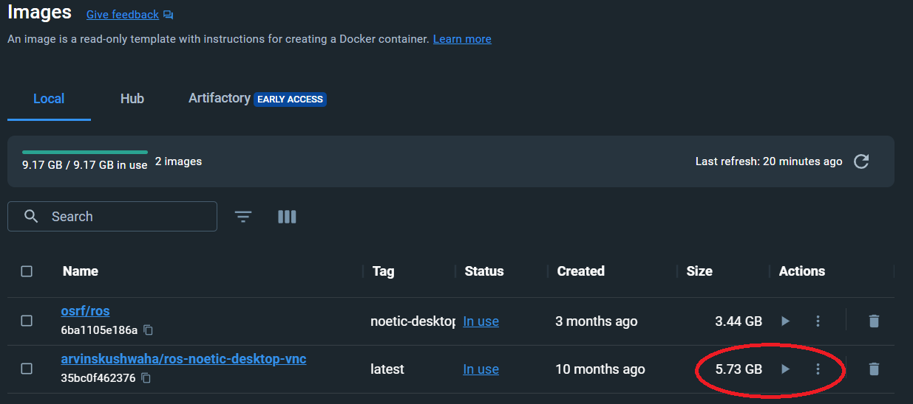
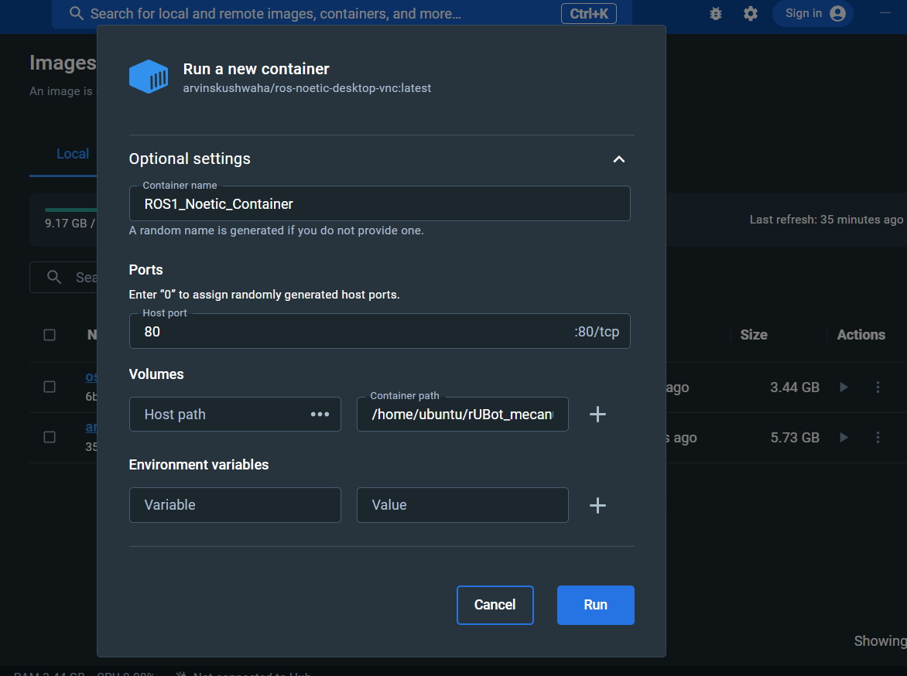
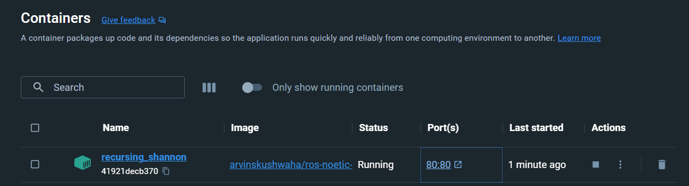
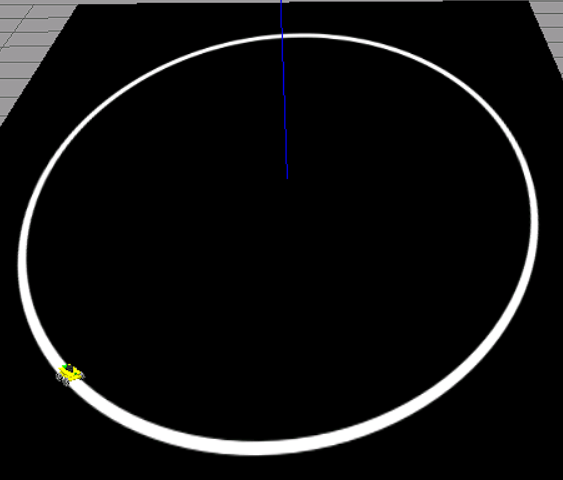
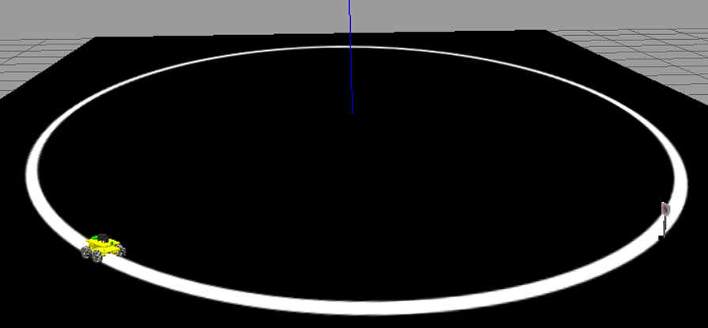
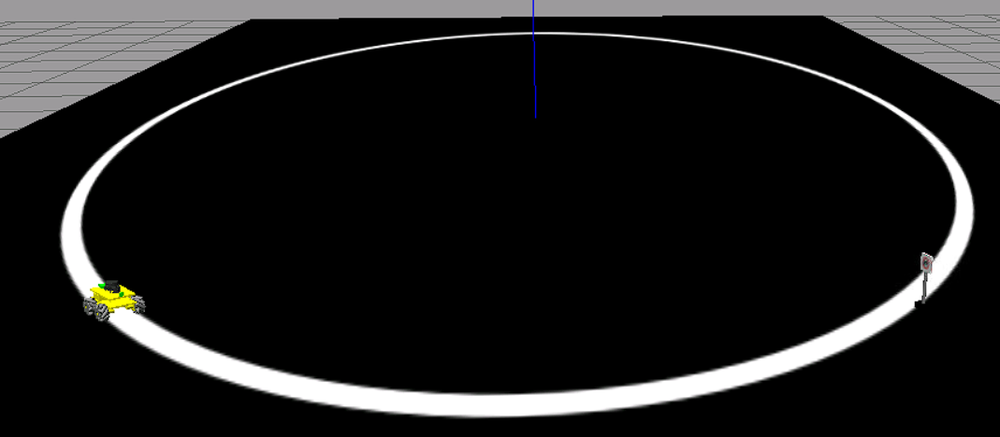
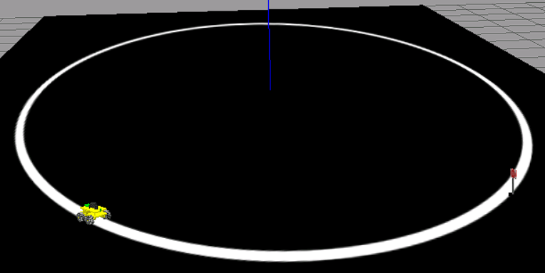

# **rUBot Custom model & control**

We have designed and assembles a custom mecanum robot.

The mechanical structure is descrived below:<br>


His main characteristics are: 
- Arduino based control for sensors & actuators
    - Servomotr actuartos for the 4 mecanum wheels
- As onboard controll it's used RaspberryPi4 (due to out of stock, can be used other onboard controller such as ROCK PI 4)
    - RPlidar distance sensor
    - Two logitech C270 to capture the image and realize the line following and traffic sign detection

In this document we will describe:
- Software needed to start.
- Bringup SW and HW
- Kinematic Movement Control
- Self-Navigation
- Wall follower
- Line follower
- Traffic signal identification


## **1. Software needed to start**

First, you'll need to install the necessary software on your computer. We will work with Docker Desktop. This software will allow us to emulate an Ubuntu SO on our computer running Windows or MAC.
Then we can download the sofware from the official website:  [Docker Desktop - Download](https://www.docker.com/products/docker-desktop/).

Once downloaed, we have to download the image of Docker (a package that contains everything needed to run the application in different environments) and configure the contariner.
- Open Docker Desktop
- Go to the top search bar (or press "CTRL+K" on windows, "command+K" on MAC)
- Type <b>arvinskushwaha/ros-noetic-desktop-vnc</b> and select "Images" below the search bar, then donwload the image<br>
- After downloaded, click on Images in the left-hand side menu (second option on the previous image) and click on the Play button to mount the image onto a Docker container<br>
- Below are the cointainer settings:
    - <b>Container name:</b> Name that our cointainer will have. Spaces and special characters are not allowed.
    - <b>Host port:</b> By default we will use 80.
    - <b>Host path:</b> You should have downloaded rUBot_mecanum_ws, if not download it from [THIS LINK](https://github.com/manelpuig/rUBot_mecanum_ws/archive/refs/heads/master.zip), unzip and save it to your computer. <u>Try to save it to a local folder, rather than a folder that syncs with onedrive.</u> For example: C:\Users\uri\Desktop\rUBot_tutorioal_ws
    - <b>Container path:</b> Directory where we will have it synchronised with our WS in Windows. By default /home/ubuntu/rUBot_mecanum_ws<br><br><br>

At this point we have all ready to start to work on our rUBot proejct

## **2. Bringup HW and SW**
### **2.1 Bringup SW**
Now that we have everything installed, we can run our container. So launch Docker Desktop and go to Containers menu. Find the container that we created and press the Play button, in this example my container it's named as ROS1_Noetic_Container.
After a few seconds we can click on the port 80:80 and it will open a browser with a localhost.<br><br>
First of all, we need to locate the folder where our workspace is located and compile the project, in this case the directory you previously specified in the container path. In this example my workspace is in `/home/ubuntu/rUBot_mecanum_ws`.
To compile the project you have to open a terminal in this folder and execute the following command:
```shell
cd /home/ubuntu/rUBot_mecanum_ws #go to the directory where you have the workspace
catkin_make #compile the project
```
You can now close the terminal. Now let's modify the .bashrc file. Open a new folder and click on the View option in the top settings bar, then select the "Show Hidden" option. Now go to `/root/` and open the .bashrc file and add this code at the bottom:
```Bash
(...)
GAZEBO_MODEL_PATH=/home/ubuntu/rUBot_mecanum_ws/src/rubot_mecanum_description/models:$GAZEBO_MODEL_PATH
source /opt/ros/noetic/setup.bash
source /home/ubuntu/rUBot_mecanum_ws/devel/setup.bash
cd /home/ubuntu/rUBot_mecanum_ws
```
This way, every time we open a terminal, it will be located in our workspace.

### Bring up SW
In this project we have four different worlds in which we can emulate our rUBot. To choose which one we want to work on, there is a Python script that allows you to choose one of these three. To execute this script, open a terminal inside of rUBot_mecanum_ws and type the following command:
```shell
python world_select.py
```
You will see four options, then select select the one you want:

|1: road.world|2: road_left.world|3: road_right.world|4: road_stop.world|
|-------------|------------------|-------------------|------------------|
|Perfect environment to test line following functionality|Perfect environment to test left signal detection. Same as the road.world but with a left signal|Perfect environment to test right signal detection. Same as the road.world but with a right signal|Perfect environment to test stop signal detection. Same as the road.world but with a stop signal|
|||
