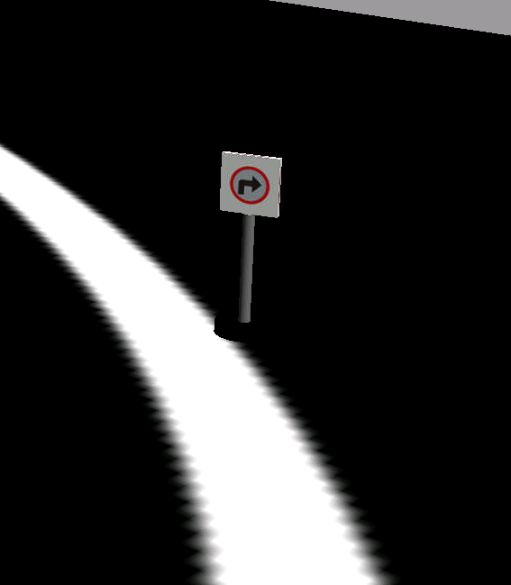

# **rUBot Custom model & control**

We have designed and assembles a custom mecanum robot.

The mechanical structure is descrived below:<br>


His main characteristics are: 
- Arduino based control for sensors & actuators
    - Servomotr actuartos for the 4 mecanum wheels
- As onboard controll it's used RaspberryPi4 (due to out of stock, can be used other onboard controller such as ROCK PI 4)
    - RPlidar distance sensor
    - Two logitech C270 to capture the image and realize the line following and traffic sign detection

In this document we will describe:
- Software needed to start.
- Bringup SW and HW
- Movement Control
- Self-Navigation
- Wall follower
- Line follower
- Traffic signal identification


## **1. Software needed to start**

First, you'll need to install the necessary software on your computer. We will work with Docker Desktop. This software will allow us to emulate an Ubuntu SO on our computer running Windows or MAC.
Then we can download the sofware from the official website:  [Docker Desktop - Download](https://www.docker.com/products/docker-desktop/).

Once downloaed, we have to download the image of Docker (a package that contains everything needed to run the application in different environments) and configure the contariner.
- Open Docker Desktop
- Go to the top search bar (or press "CTRL+K" on windows, "command+K" on MAC)
- Type <b>arvinskushwaha/ros-noetic-desktop-vnc</b> and select "Images" below the search bar, then donwload the image<br>
- After downloaded, click on Images in the left-hand side menu (second option on the previous image) and click on the Play button to mount the image onto a Docker container<br>
- Below are the cointainer settings:
    - <b>Container name:</b> Name that our cointainer will have. Spaces and special characters are not allowed.
    - <b>Host port:</b> By default we will use 80.
    - <b>Host path:</b> You should have downloaded rUBot_mecanum_ws, if not download it from [THIS LINK](https://github.com/manelpuig/rUBot_mecanum_ws/archive/refs/heads/master.zip), unzip and save it to your computer. <u>Try to save it to a local folder, rather than a folder that syncs with onedrive.</u> For example: C:\Users\uri\Desktop\rUBot_tutorioal_ws
    - <b>Container path:</b> Directory where we will have it synchronised with our WS in Windows. By default /home/ubuntu/rUBot_mecanum_ws<br><br><br>

At this point we have all ready to start to work on our rUBot proejct

## **2. Bringup**
### **2.1 SW**
Now that we have everything installed, we can run our container. So launch Docker Desktop and go to Containers menu. Find the container that we created and press the Play button, in this example my container it's named as ROS1_Noetic_Container.
After a few seconds we can click on the port 80:80 and it will open a browser with a localhost.<br><br>
First of all, we need to locate the folder where our workspace is located and compile the project, in this case the directory you previously specified in the container path. In this example my workspace is in `/home/ubuntu/rUBot_mecanum_ws`.
To compile the project you have to open a terminal in this folder and execute the following command:
```shell
cd /home/ubuntu/rUBot_mecanum_ws #go to the directory where you have the workspace
catkin_make #compile the project
```
You can now close the terminal. Now let's modify the .bashrc file. Open a new folder and click on the View option in the top settings bar, then select the "Show Hidden" option. Now go to `/root/` and open the .bashrc file and add this code at the bottom:
```Bash
(...)
GAZEBO_MODEL_PATH=/home/ubuntu/rUBot_mecanum_ws/src/rubot_mecanum_description/models:$GAZEBO_MODEL_PATH
source /opt/ros/noetic/setup.bash
source /home/ubuntu/rUBot_mecanum_ws/devel/setup.bash
cd /home/ubuntu/rUBot_mecanum_ws
```
This way, every time we open a terminal, it will be located in our workspace.

### Bring up SW
The platform of the rUBot 2.0 is larger and designed to be able to transport objects. The main difference with the rUBot 1.0 is that it consists of two Logitech C270 webcams, one that will be in charge of processing the images for line tracking and the other for signal detection. in the image below you can see the rubot 2.0 with the arrangement of its two webcams.
<p align="center">
  <br>
</p>
To create a world in gazebo you first have to create the model. In this case the model called "road_circle" has been used. For details see rUBot_mecanum_ws/src/rubot_mecanum_description/models/road_circle.<br>
Inside the road_circle folder there are two files and a folder:<br>
- model.config: This is a configuration file used in Gazebo to describe the properties and metadata of a model. This file is used to provide information about the model and to configure its behaviour within the simulation environment<br>
- model.sdf: is a Simulation Description Format (SDF) file used in Gazebo to describe the structure, physical properties, graphics and other attributes of a model.<br>
Inside the "materials" folder there will be two more folders, one called "scripts" and one called "textures".<br>
- Scripts folder: A file called road_circle.material is created. It is a configuration file used in Ogre, the rendering engine used by Gazebo, to define materials and shaders used in the visual representation of the objects in the simulation. The name "road_circle" refers to the name of the specific material file you are using.<br>
- Textures folder: A .png file is added with the texture we want to add.<br>
Models have been created for the ground (the circle for the line following) and the various road signs.<br>
In this project we have four different worlds in which we can emulate our rUBot. To choose which one we want to work on, there is a Python script that allows you to choose one of these three. To execute this script, open a terminal inside of rUBot_mecanum_ws and type the following command:

```shell
python world_select.py
```
You will see four options, then select select the one you want:

|1: road.world|2: road_left.world|3: road_right.world|4: road_stop.world|
|-------------|------------------|-------------------|------------------|
|||
|Perfect environment to test line following functionality|Perfect environment to test left signal detection. Same as the road.world but with a left signal|Perfect environment to test right signal detection. Same as the road.world but with a right signal|Perfect environment to test stop signal detection. Same as the road.world but with a stop signal|

In the simulation bingup, the following nodes are run:<br>

**empty_world.launch:** This node is launched using the gazebo_ros package. It is responsible for starting the Gazebo simulation environment with an empty world. It receives as argument the name of the world file (road.world) and is specified by including the corresponding file.

**spawn_model:** This node is launched using the gazebo_ros package. It is responsible for creating and placing a model in the Gazebo simulation environment. It receives several arguments, including the path to the model's URDF file (rubot_rp.urdf) and the position (x_pos, y_pos, z_pos) and orientation (yaw) coordinates of the model in the environment. The model is created with the name "rUBot" and the robot_description parameter is used to load the robot description from the URDF file.

**joint_state_publisher:** This node is launched using the joint_state_publisher package. It is responsible for publishing simulated joint values for the model. It is configured not to display a GUI (use_gui is set to "False").

**robot_state_publisher:** This node is launched using the robot_state_publisher package. It is responsible for publishing the state of the robot model in the global coordinate system. It uses the description of the robot provided in the robot_description parameter to obtain the direct kinematics of the model.

**rviz:** This node is launched using the rviz package. It is a 3D visualisation tool that displays the robot model and other data in real time. It receives an RViz configuration file (rubot_nav.rviz) via the -d argument to set the appropriate visualisation configuration.


These nodes work together to set up the simulation environment in Gazebo, load the robot model, publish joint states and visualise the model in RViz.
At this point we have all ready to start testing in a simulated environment.
### **2.2 HW**
To use the HW, you need to install the NoMachine SW. You can get from this link: [NoMachine - Official website](https://www.nomachine.com/es) <br>
Once NoMachine is installed, we need to add a new connection by clicking on the Add button and filling in the fields as shown in the image:<br>
- <b>Nombre: </b>rUBot_XX where XX indicates the number of your rUBot. In this case is 01.
- <b>Host: </b>10.42.0.1
- <b>Puerto: </b>4000
- <b>Protocolo: </b>NX<br><br>
Make sure that you have turned on your Raspberri Pi (or your onboard controller) which was previously configured to generate an access point. In this case, our onboard controller creates a wifi network called "rUBot_01". Note that you will lose your internet connection when you connect to your board. In this case this wifi network is:
When powering the raspberrypi4, generates a hotspot you have to connect to:
- SSID name: rUBot_01 
- password "rUBot_Mec"

Once you are connected to this network you will be able to connect your computer to the raspberrypi4 using NoMachine viewer:
- In PC open NoMachine viewer
- Select the connection we configured before
- you have to specify:
    - user: ubuntu
    - password: ubuntu1234
- You will have the raspberrypi4 desktop on your windows NoMachine screen
<br>
Now open a terminal in your workspace folder and type the following command:
```shell
roslaunch rubot_projects rubot_bringup_hw.launch
```

The nodes that are executed when running rubot_bringup_hw.launch are the following: <br>
- **joint_state_publisher:** This node is responsible for publishing values of the rUBot's wheels.
- **robot_state_publisher:** This node is used to publish the state of the robot, including the transformation between the robot's reference frames. The robot_state_publisher package is used to run this node.
- **rviz:** This node is used to run the RViz visualisation application, which allows the visualisation and analysis of 3D data of the robot and its environment. The rviz package is used to run this node.
- **serial_node:** This node is part of the rosserial_python package and is used to communicate with a serial device, in this case, it is being used to communicate on port /dev/ttyACM0 with a baud rate of 500000.
- **rplidar.launch:** The rplidar.launch file, provided by the rplidar_ros package, is launched to start and configure the node related to the RPLidar lidar laser scanner. Following the configuration for the Lidar, described inside the rplidar.launch file:<br>
*- serial_port:* Specifies the serial port to which the laser scanner is connected. In this case, it is set to /dev/ttyUSB0.<br>
*- serial_baudrate:* Specifies the baud rate used for communication with the laser scanner. In this case, it is set to 115200.<br>
*- frame_id:* Specifies the reference frame associated with the laser scanner. In this case, it is set to "base_link".<br>
*- inverted:* Specifies whether the laser scanner is inverted or not. In this case, it is set to false, which means that it is not inverted.<br>
*- angle_compensate:* Specifies whether angle compensation of the laser scanner is performed. In this case, it is set to true, which means that compensation is applied.
- **usb_cam.launch:** The launch file usb_cam.launch, provided by the rubot_projects package, is launched to start and configure the USB camera related node.


## **3. Movement Control**
### **Movement control with python script**

From the "rUBot_mecanum_ws" workspace, the src/rubot_control/ folder has 2 new folders:
- scrip folder: with the python programs for specific movement control
- launch folder: with programs to launch the movement control

Diferent navigation programs are created:

- Navigation control: to define a desired robot velocity
- Lidar test: to verify the LIDAR readings and angles
- Autonomous navigation: to perform a simple algorithm for navigation with obstacle avoidance using the LIDAR
- Wall follower: at a fixed distance to perform a good map
- go to POSE: attend a specific position and orientation

The nodes and topics structure corresponds to the following picture:


### **a) Keyboard Movement Control**
To control the gopigo robot with keyboard, we need to install "teleop_tools" package. Open a new terminal and install the packages:
```shell
sudo apt-get install ros-noetic-teleop-tools
sudo apt-get install ros-noetic-teleop-twist-keyboard
```
Proceed with:
- Bringup rUBot_mecanum
```shell
roslaunch rubot_control rubot_bringup_hw.launch
```
- Then open a new terminal and type:
```shell
rosrun key_teleop key_teleop.py /key_vel:=/cmd_vel
or
rosrun teleop_twist_keyboard teleop_twist_keyboard.py
```
### **b) Navigation control**

We have created a first navigation python files in "src" folder:

- rubot_nav.py: to define the movement with vx, vy and w to reach a maximum distance in x or y

A "node_nav.launch" file is created to launch the node and python file created above.

To properly perform a especific movement control we have first to:
- Bringup rUBot_mecanum
```shell
roslaunch rubot_control rubot_bringup_hw.launch
```
- Then open a new terminal to launch the rUBot_nav node to perform the specific movement control.
```shell
roslaunch rubot_control rubot_nav.launch
```

## **3. Self-Navigation**

Using rpLIDAR sensor you can perform the autonomous navigation avoiding obstacles.

This performance is defined in "rubot_self_nav.py"

To properly perform a especific self-navigation control we have first to:
- Bringup rUBot_mecanum
```shell
roslaunch rubot_control rubot_bringup_hw.launch
```
- Then open a new terminal to launch the rUBot_nav node to perform the self-navigation. We have created specific python file and launch file for this navigation control
```shell
roslaunch rubot_control rubot_self_nav.launch
```
The launch file contains some parameters you can modify:
```xml
<launch>
  <!-- launch obstacle avoidance   -->
    <arg name="distance_laser" default="0.4" />
    <arg name="speed_factor" default="0.1"/>
    <arg name="forward_speed" default="2" />
    <arg name="backward_speed" default="-2" />
    <arg name="rotation_speed" default="15" />
    <node name="rubot_nav" pkg="rubot_control" type="rubot_self_nav.py" output="screen" >
        <param name="distance_laser" value="$(arg distance_laser)"/>
        <param name="speed_factor" value="$(arg speed_factor)"/>
        <param name="forward_speed" value="$(arg forward_speed)"/>
        <param name="backward_speed" value="$(arg backward_speed)"/>
        <param name="rotation_speed" value="$(arg rotation_speed)"/>
    </node>    
</launch>
```
In order to see the rubot with the topics information we will use rviz. Open rviz in a new terminal.

In rviz, select the fixed frame to "odom", and add Camera and LaserScan with the corresponding topics names.

You can then save the config file as laserscan.rviz name and use it in the launch file


A launch file is created to integrate all the needed roslaunch parameters but you can change the defauld values with this syntax:
```shell
roslaunch rubot_control rubot_self_nav.launch distance_laser:=0.5 speed_factor:=0.5
```
## **4. Wall Follower**

This control task consist on find a wall and follow it at a certain distance. We will see that this is an important control task because this will be used later to make accurate maps of working environments.

We have developed 2 different methods for wall follower:
- Geometrical method
- Lidar ranges method

#### **a) Geometrical method**
In src folder you create the python file for wall follower purposes

The instructions to perform the python program are in the notebook: 

https://github.com/Albert-Alvarez/ros-gopigo3/blob/lab-sessions/develop/ROS%20con%20GoPiGo3%20-%20S4.md


To properly perform a especific self-navigation control we have first to:
- Bringup rUBot_mecanum
```shell
roslaunch rubot_control rubot_bringup_hw.launch
```
- Then open a new terminal to launch the rUBot_nav node to perform the wall-follower. We have created specific python file and launch file for this navigation control
```shell
roslaunch rubot_control rubot_wall_follower_gm.launch
```
The launch file contains different parameters you can modify:
```xml
<launch>
  <!-- launch follow wall   -->
  <arg name="kp" default="5" />
  <arg name="distance_reference" default="0.3" />
  <arg name="lookahead_distance" default="0.4" />
  <arg name="forward_speed" default="0.04" />
  <arg name="theta" default="50.0" />
  <node name="wall_follower_controller" pkg="gopigo_control" type="rubot_wall_follower_gm.py" output="screen" >
    <param name="kp" value="$(arg kp)"/>
    <param name="distance_reference" value="$(arg distance_reference)"/>
    <param name="lookahead_distance" value="$(arg lookahead_distance)"/>
    <param name="forward_speed" value="$(arg forward_speed)"/>
    <param name="theta" value="$(arg theta)"/>
  </node>
</launch>
```
You can see the video result:

[](https://youtu.be/z5sAyiFs-RU)

#### **b) ranges method**
In src folder you create the python file for wall follower purposes

The algorith is based on laser ranges test and depends on the LIDAR type:


Take into account that:
- RP LIDAR has 180º rotation
- YDlidar in front direction has 2 different ranges [660:719] and [0:60]
- YDlidar sends some 0 values due to wrong readings. They have to be changed to high value to be able to take the minimum falue from the desired range.

To properly perform a especific self-navigation control we have first to:
- Bringup rUBot_mecanum
```shell
roslaunch rubot_control rubot_bringup_hw.launch
```
- Then open a new terminal to launch the rUBot_nav node to perform the wall-follower. We have created specific python file and launch file for this navigation control
```shell
roslaunch rubot_control rubot_wall_follower_rg.launch
```
The launch file has no parameters to modify:

```xml
<launch>
  <!-- launch follow wall   -->
  <node name="wall_follow" pkg="rubot_control" type="rubot_wall_follower_rg.py" output="screen" >
  </node>
</launch>
```
## **5. Line Follower**
### **5.1 SW**
We can simulate the line follower method to test if it's working as expected. <br>
First let's choose the world, open a terminal in to our workspace:
```shell
python world_select
```
Select the first world (empty world), then open another terminal tab and type the following command:
```shell
roslaunch rubot_projects line_following.launch
```
It will execute the launch file for line_following script:
```python
#!/usr/bin/env python3
import rospy
import sys
import time
import numpy as np
from sensor_msgs.msg import Image
from geometry_msgs.msg import Twist
from cv_bridge import CvBridge
import cv2

class camera_sub:

    def __init__(self):
        rospy.init_node('line_following_sim', anonymous=True)
        self.camera_sub = rospy.Subscriber('/rubot/camera1/image_raw',Image, self.camera_cb)
        self.cmd_vel_pub = rospy.Publisher('/cmd_vel', Twist, queue_size=20)
        self.vel_msg=Twist()
        self.bridge=CvBridge()

    def camera_cb(self, data):
        frame = self.bridge.imgmsg_to_cv2(data,desired_encoding="bgr8")
        edged = cv2.Canny(frame ,60,100 )
        
        white_index=[]
        mid_point_line = 0
        for index,values in enumerate(edged[:][200]):# [172] index 0 on top
            if(values == 255):
                white_index.append(index)
                
        print("White: ",white_index)

        if(len(white_index) >= 2 ):#== some times more than 2 white points 
            cv2.circle(img=edged, center = (white_index[0],200), radius = 2 , color = (255,0,0), thickness=1)
            cv2.circle(img=edged, center = (white_index[1],200), radius = 2 , color = (255,0,0), thickness=1)
            mid_point_line = int ( (white_index[0] + white_index[1]) /2 )
            cv2.circle(img=edged, center = (mid_point_line,200), radius = 3 , color = (255,0,0), thickness=2)

        mid_point_robot = [160,200]#[135,172]
        cv2.circle(img=edged, center = (mid_point_robot[0],mid_point_robot[1]), radius = 5 , color = (255,0,0), thickness=2)
        error = mid_point_robot[0] - mid_point_line
        print("Error -> " , error)

        # Proportional control
        Kp = 0.01 # Proportional gain
        if (len(white_index) >= 2):
            self.vel_msg.angular.z = Kp * error
            self.vel_msg.linear.x = 0.2 # Set a constant forward velocity
        else:
            self.vel_msg.angular.z = 0.2 # Turn right if no line is detected
            self.vel_msg.linear.x = 0.0 # Stop moving forward
        
        self.cmd_vel_pub.publish(self.vel_msg)

        cv2.imshow('Frame',frame)
        cv2.imshow('Canny Output',edged)
        cv2.waitKey(1)

    def move(args=None):
        rospy.spin()

if __name__ == '__main__':
    try:
        line_following = camera_sub()
        line_following.move()
    except KeyboardInterrupt:
        print ("Ending MoveForward")
```
The code implements a ROS node in Python that subscribes to the image message coming from the camera (/rubot/camera1/image_raw). The goal of the node is to follow a line in the image using image processing and proportional control techniques.

Below is a summary of the main parts of the code:

1. The necessary packages and modules are imported, including rospy for communication with ROS, numpy for numerical operations, cv2 for image processing using OpenCV and the necessary ROS messages (Image and Twist).

2. A class called camera_sub is defined to represent the ROS node. The constructor __init__ initialises the node, creates the necessary subscribers and publishers, and sets important variables.

3. The camera_cb method is the callback that is executed each time an image message is received from the camera. In this method, image processing is performed to detect the line.

- The image is converted from ROS format to OpenCV format using cv_bridge.
- The Canny operator is applied to obtain the edges of the image.
- The white pixels in the region of interest are identified and their indices are stored in the white_index list.
- The midpoint of the line is calculated from the white pixel indices.
- The error is calculated as the difference between the position of the midpoint of the line and the desired position of the robot.
4. A proportional control is defined to adjust the angular velocity of the robot according to the error. If the line is detected (at least 2 white pixels), the angular velocity is calculated proportionally to the error. In addition, a constant linear velocity is set. If the line is not detected, the robot turns to the right and stops.

5. The velocity commands (Twist) are published in the /cmd_vel topic using the cmd_vel_pub publisher.

6. The original image and the processed image are displayed in separate windows using cv2.imshow.

7. The move method is used to keep the node running using rospy.spin().

8. In the if __name__ == '__main__': block, an instance of the camera_sub class is created, the move method is called and a KeyboardInterrupt exception is caught to properly terminate the node when Ctrl+C is pressed.
### **5.2 HW**
```python
#!/usr/bin/env python3
import rospy
import sys
import time
import numpy as np
from sensor_msgs.msg import Image
from geometry_msgs.msg import Twist
import cv2
from cv_bridge import CvBridge
from keras.models import load_model
from PIL import Image, ImageOps

class CameraSub:

    def __init__(self):
        rospy.init_node('line_following_sim', anonymous=True)
        self.line_sub = rospy.Subscriber('/usb_cam0/image_raw', Image, self.line_cb)
        self.sign_sub = rospy.Subscriber('/usb_cam1/image_raw', Image, self.sign_cb)
        self.cmd_vel_pub = rospy.Publisher('/cmd_vel', Twist, queue_size=10)
        self.vel_msg = Twist()
        self.bridge = CvBridge()
        self.model = load_model("keras_Model.h5", compile=False)
        self.class_names = open("labels.txt", "r").readlines()

    def line_cb(self, data):
        frame = self.bridge.imgmsg_to_cv2(data, desired_encoding="bgr8")
        hsvFrame = cv2.cvtColor(frame, cv2.COLOR_BGR2HSV)

        # Line following code
        yellow_lower = np.array([0, 0, 0], np.uint8)
        yellow_upper = np.array([180, 255, 30], np.uint8)

        yellow_mask = cv2.inRange(hsvFrame, yellow_lower, yellow_upper)
        kernal = np.ones((5, 5), "uint8")
        yellow_mask = cv2.dilate(yellow_mask, kernal)
        res_yellow = cv2.bitwise_and(frame, frame, mask=yellow_mask)

        # Line following logic
        white_index = []
        mid_point_line = 5
        for index, values in enumerate(yellow_mask[:][200]):
            if values == 255:
                white_index.append(index)

        print("White:", white_index)

        if len(white_index) >= 2:
            cv2.circle(img=yellow_mask, center=(white_index[0], 100), radius=2, color=(255, 0, 0), thickness=1)
            cv2.circle(img=yellow_mask, center=(white_index[1], 100), radius=2, color=(255, 0, 0), thickness=1)
            mid_point_line = int((white_index[0] + white_index[1]) / 2)
            cv2.circle(img=yellow_mask, center=(mid_point_line, 100), radius=3, color=(255, 0, 0), thickness=2)

        mid_point_robot = [160, 100]
        cv2.circle(img=yellow_mask, center=(mid_point_robot[0], mid_point_robot[1]), radius=5, color=(255, 0, 0), thickness=2)
        error = mid_point_robot[0] - mid_point_line
        print("Error:", error)

        if error < 0:
            self.vel_msg.angular.z = -0.1
        else:
            self.vel_msg.angular.z = 0.1

        self.vel_msg.linear.x = 0.05

        self.cmd_vel_pub.publish(self.vel_msg)

        cv2.imshow('Line Following', frame)
        cv2.imshow('Yellow mask', yellow_mask)
        cv2.imshow('Yellow rest', res_yellow)
        cv2.waitKey(1)

    def sign_cb(self, data):
        frame = self.bridge.imgmsg_to_cv2(data, desired_encoding="bgr8")

        # Sign detection code
        image = Image.fromarray(cv2.cvtColor(frame, cv2.COLOR_BGR2RGB))
        size = (224, 224)
        image = ImageOps.fit(image, size, Image.Resampling.LANCZOS)
        image_array = np.asarray(image)
        normalized_image_array = (image_array.astype(np.float32) / 127.5) - 1
        data = np.ndarray(shape=(1, 224, 224, 3), dtype=np.float32)
        data[0] = normalized_image_array

        prediction = self.model.predict(data)
        index = np.argmax(prediction)
        class_name = self.class_names[index]
        confidence_score = prediction[0][index]

        print("Class:", class_name[2:])
        print("Confidence Score:", confidence_score)

        if class_name == "STOP":
            self.stop()
        elif class_name == "LEFT":
            self.turn_left()
        elif class_name == "RIGHT":
            self.turn_right()

        cv2.imshow('Sign Detection', frame)
        cv2.waitKey(1)

    def stop(self):
        self.vel_msg.angular.z = 0.0
        self.vel_msg.linear.x = 0.0
        self.cmd_vel_pub.publish(self.vel_msg)

    def turn_left(self):
        self.vel_msg.angular.z = 0.2
        self.vel_msg.linear.x = 0.0
        self.cmd_vel_pub.publish(self.vel_msg)

    def turn_right(self):
        self.vel_msg.angular.z = -0.2
        self.vel_msg.linear.x = 0.0
        self.cmd_vel_pub.publish(self.vel_msg)

    def move(self):
        rospy.spin()

if __name__ == '__main__':
    try:
        line_following = CameraSub()
        line_following.move()
    except KeyboardInterrupt:
        print("Ending MoveForward")
```

The code implements a node that uses the two cameras to perform one-line tracking and traffic sign detection. The node subscribes to image messages from the cameras (/usb_cam0/image_raw and /usb_cam1/image_raw) and publishes speed commands to the /cmd_vel topic to control the movement of a robot.

A class called CameraSub is defined which represents the ROS node. The __init__ constructor initialises the node, creates the necessary subscribers and publishers, and loads a pre-trained traffic signal classification model and corresponding classes.

The line_cb method is executed each time an image message is received from the line tracking camera. In this method, the image is processed to detect the line. The image is converted to OpenCV format, converted to HSV colour space and a mask is applied to detect yellow pixels, representative of the line. The error is then calculated as a function of the detected line position and the angular velocity of the robot is adjusted.

The sign_cb method is executed each time an image message is received from the traffic sign detection camera. Signal detection is performed here using a pre-trained classification model. The image is processed and resized to match the format required by the model. Then, a prediction is made using the model and actions are taken based on the detected class, such as stop, left turn or right turn.

Furthermore, additional methods are defined to adjust the speed commands according to the required actions, such as stop, turn left or turn right.

Finally, the processed images are displayed in separate windows using OpenCV, and the rospy.spin() method is used to keep the node running.

## **6. Traffic Identification**
The method used to detect the STOP signal in this code is the use of an OpenCV Haar cascade classifier.
```python
self.stop_cascade = cv2.CascadeClassifier('/home/ubuntu/rUBot_mecanum_ws/src/rubot_projects/src/stop_sign.xml')
```
The cascade classifier previously trained to detect STOP signals is loaded. Then, in the 'camera_cb' function, STOP signal detection is performed using this classifier:
```python
gray = cv2.cvtColor(frame, cv2.COLOR_BGR2GRAY)
stop_signs = self.stop_cascade.detectMultiScale(gray, 1.1, 5)
if len(stop_signs) > 0:
    print("Señal de STOP detectada")
    # Detener el robot
    self.vel_msg.linear.x = 0
    self.vel_msg.angular.z = 0
    self.cmd_vel_pub.publish(self.vel_msg)
    return
```
First, the camera frame is converted to greyscale using 'cv2.cvtColor'. Then, the 'detectMultiScale' function of the cascade classifier is used to search for the presence of the STOP sign in the grayscale image. If the STOP signal is detected (the length of 'stop_signs' is greater than 0), a message is printed, the robot is stopped and a zero speed message is posted in the '/cmd_vel' topic. <br>
You can find the STOP model on the following path: oborqueg/rUBot_mecanum_ws/Documentation/files/Models/stop_sign.xml