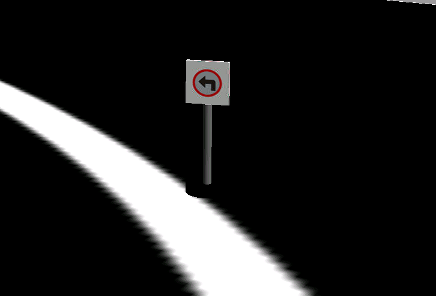

# **rUBot Custom model & control**

We have designed and assembles a custom mecanum robot.

The mechanical structure is descrived below:<br>


His main characteristics are: 
- Arduino based control for sensors & actuators
    - Servomotr actuartos for the 4 mecanum wheels
- As onboard controll it's used RaspberryPi4 (due to out of stock, can be used other onboard controller such as ROCK PI 4)
    - RPlidar distance sensor
    - Two logitech C270 to capture the image and realize the line following and traffic sign detection

In this document we will describe:
- Software needed to start.
- Bringup SW and HW
- Movement Control
- Self-Navigation
- Wall follower
- Line follower
- Traffic signal identification


## **1. Software needed to start**

First, you'll need to install the necessary software on your computer. We will work with Docker Desktop. This software will allow us to emulate an Ubuntu SO on our computer running Windows or MAC.
Then we can download the sofware from the official website:  [Docker Desktop - Download](https://www.docker.com/products/docker-desktop/).

Once downloaed, we have to download the image of Docker (a package that contains everything needed to run the application in different environments) and configure the contariner.
- Open Docker Desktop
- Go to the top search bar (or press "CTRL+K" on windows, "command+K" on MAC)
- Type <b>arvinskushwaha/ros-noetic-desktop-vnc</b> and select "Images" below the search bar, then donwload the image<br>
- After downloaded, click on Images in the left-hand side menu (second option on the previous image) and click on the Play button to mount the image onto a Docker container<br>
- Below are the cointainer settings:
    - <b>Container name:</b> Name that our cointainer will have. Spaces and special characters are not allowed.
    - <b>Host port:</b> By default we will use 80.
    - <b>Host path:</b> You should have downloaded rUBot_mecanum_ws, if not download it from [THIS LINK](https://github.com/manelpuig/rUBot_mecanum_ws/archive/refs/heads/master.zip), unzip and save it to your computer. <u>Try to save it to a local folder, rather than a folder that syncs with onedrive.</u> For example: C:\Users\uri\Desktop\rUBot_tutorioal_ws
    - <b>Container path:</b> Directory where we will have it synchronised with our WS in Windows. By default /home/ubuntu/rUBot_mecanum_ws<br><br><br>

At this point we have all ready to start to work on our rUBot proejct

## **2. Bringup HW and SW**
### **2.1 Bringup SW**
Now that we have everything installed, we can run our container. So launch Docker Desktop and go to Containers menu. Find the container that we created and press the Play button, in this example my container it's named as ROS1_Noetic_Container.
After a few seconds we can click on the port 80:80 and it will open a browser with a localhost.<br><br>
First of all, we need to locate the folder where our workspace is located and compile the project, in this case the directory you previously specified in the container path. In this example my workspace is in `/home/ubuntu/rUBot_mecanum_ws`.
To compile the project you have to open a terminal in this folder and execute the following command:
```shell
cd /home/ubuntu/rUBot_mecanum_ws #go to the directory where you have the workspace
catkin_make #compile the project
```
You can now close the terminal. Now let's modify the .bashrc file. Open a new folder and click on the View option in the top settings bar, then select the "Show Hidden" option. Now go to `/root/` and open the .bashrc file and add this code at the bottom:
```Bash
(...)
GAZEBO_MODEL_PATH=/home/ubuntu/rUBot_mecanum_ws/src/rubot_mecanum_description/models:$GAZEBO_MODEL_PATH
source /opt/ros/noetic/setup.bash
source /home/ubuntu/rUBot_mecanum_ws/devel/setup.bash
cd /home/ubuntu/rUBot_mecanum_ws
```
This way, every time we open a terminal, it will be located in our workspace.

### Bring up SW
In this project we have four different worlds in which we can emulate our rUBot. To choose which one we want to work on, there is a Python script that allows you to choose one of these three. To execute this script, open a terminal inside of rUBot_mecanum_ws and type the following command:
```shell
python world_select.py
```
You will see four options, then select select the one you want:

|1: road.world|2: road_left.world|3: road_right.world|4: road_stop.world|
|-------------|------------------|-------------------|------------------|
|||
|Perfect environment to test line following functionality|Perfect environment to test left signal detection. Same as the road.world but with a left signal|Perfect environment to test right signal detection. Same as the road.world but with a right signal|Perfect environment to test stop signal detection. Same as the road.world but with a stop signal|

At this point we have all ready to start testing in a simulated environment.
### **2.2 Bringup HW**
To use the HW, you need to install the NoMachine SW. You can get from this link: [NoMachine - Official website](https://www.nomachine.com/es) <br>
Once NoMachine is installed, we need to add a new connection by clicking on the Add button and filling in the fields as shown in the image:<br>
- <b>Nombre: </b>rUBot_XX where XX indicates the number of your rUBot. In this case is 01.
- <b>Host: </b>10.42.0.1
- <b>Puerto: </b>4000
- <b>Protocolo: </b>NX<br><br>
Make sure that you have turned on your Raspberri Pi (or your onboard controller) which was previously configured to generate an access point. In this case, our onboard controller creates a wifi network called "rUBot_01". Note that you will lose your internet connection when you connect to your board. In this case this wifi network is:
When powering the raspberrypi4, generates a hotspot you have to connect to:
- SSID name: rUBot_01 
- password "rUBot_Mec"

Once you are connected to this network you will be able to connect your computer to the raspberrypi4 using NoMachine viewer:
- In PC open NoMachine viewer
- Select the connection we configured before
- you have to specify:
    - user: ubuntu
    - password: ubuntu1234
- You will have the raspberrypi4 desktop on your windows NoMachine screen
<br>
Now open a terminal in your workspace folder and type the following command:
```shell
roslaunch rubot_projects rubot_bringup_hw.launch
```
Then the bring up hardware will be done.

## **3. Movement Control**
### **a) Keyboard Movement Control**
To control the gopigo robot with keyboard, we need to install "teleop_tools" package. Open a new terminal and install the packages:
```shell
sudo apt-get install ros-noetic-teleop-tools
sudo apt-get install ros-noetic-teleop-twist-keyboard
```
Proceed with:
- Bringup rUBot_mecanum
```shell
roslaunch rubot_control rubot_bringup_hw.launch
```
- Then open a new terminal and type:
```shell
rosrun key_teleop key_teleop.py /key_vel:=/cmd_vel
or
rosrun teleop_twist_keyboard teleop_twist_keyboard.py
```
## **Movement control with python script**

From the "rUBot_mecanum_ws" workspace, the src/rubot_control/ folder has 2 new folders:
- scrip folder: with the python programs for specific movement control
- launch folder: with programs to launch the movement control

Diferent navigation programs are created:

- Navigation control: to define a desired robot velocity
- Lidar test: to verify the LIDAR readings and angles
- Autonomous navigation: to perform a simple algorithm for navigation with obstacle avoidance using the LIDAR
- Wall follower: at a fixed distance to perform a good map
- go to POSE: attend a specific position and orientation

The nodes and topics structure corresponds to the following picture:


### **b) Navigation control**

We have created a first navigation python files in "src" folder:

- rubot_nav.py: to define the movement with vx, vy and w to reach a maximum distance in x or y

A "node_nav.launch" file is created to launch the node and python file created above.

To properly perform a especific movement control we have first to:
- Bringup rUBot_mecanum
```shell
roslaunch rubot_control rubot_bringup_hw.launch
```
- Then open a new terminal to launch the rUBot_nav node to perform the specific movement control.
```shell
roslaunch rubot_control rubot_nav.launch
```

## **3. Self-Navigation**

Using rpLIDAR sensor you can perform the autonomous navigation avoiding obstacles.

This performance is defined in "rubot_self_nav.py"

To properly perform a especific self-navigation control we have first to:
- Bringup rUBot_mecanum
```shell
roslaunch rubot_control rubot_bringup_hw.launch
```
- Then open a new terminal to launch the rUBot_nav node to perform the self-navigation. We have created specific python file and launch file for this navigation control
```shell
roslaunch rubot_control rubot_self_nav.launch
```
The launch file contains some parameters you can modify:
```xml
<launch>
  <!-- launch obstacle avoidance   -->
    <arg name="distance_laser" default="0.4" />
    <arg name="speed_factor" default="0.1"/>
    <arg name="forward_speed" default="2" />
    <arg name="backward_speed" default="-2" />
    <arg name="rotation_speed" default="15" />
    <node name="rubot_nav" pkg="rubot_control" type="rubot_self_nav.py" output="screen" >
        <param name="distance_laser" value="$(arg distance_laser)"/>
        <param name="speed_factor" value="$(arg speed_factor)"/>
        <param name="forward_speed" value="$(arg forward_speed)"/>
        <param name="backward_speed" value="$(arg backward_speed)"/>
        <param name="rotation_speed" value="$(arg rotation_speed)"/>
    </node>    
</launch>
```
In order to see the rubot with the topics information we will use rviz. Open rviz in a new terminal.

In rviz, select the fixed frame to "odom", and add Camera and LaserScan with the corresponding topics names.

You can then save the config file as laserscan.rviz name and use it in the launch file


A launch file is created to integrate all the needed roslaunch parameters but you can change the defauld values with this syntax:
```shell
roslaunch rubot_control rubot_self_nav.launch distance_laser:=0.5 speed_factor:=0.5
```
## **4. Wall Follower**

This control task consist on find a wall and follow it at a certain distance. We will see that this is an important control task because this will be used later to make accurate maps of working environments.

We have developed 2 different methods for wall follower:
- Geometrical method
- Lidar ranges method

#### **a) Geometrical method**
In src folder you create the python file for wall follower purposes

The instructions to perform the python program are in the notebook: 

https://github.com/Albert-Alvarez/ros-gopigo3/blob/lab-sessions/develop/ROS%20con%20GoPiGo3%20-%20S4.md


To properly perform a especific self-navigation control we have first to:
- Bringup rUBot_mecanum
```shell
roslaunch rubot_control rubot_bringup_hw.launch
```
- Then open a new terminal to launch the rUBot_nav node to perform the wall-follower. We have created specific python file and launch file for this navigation control
```shell
roslaunch rubot_control rubot_wall_follower_gm.launch
```
The launch file contains different parameters you can modify:
```xml
<launch>
  <!-- launch follow wall   -->
  <arg name="kp" default="5" />
  <arg name="distance_reference" default="0.3" />
  <arg name="lookahead_distance" default="0.4" />
  <arg name="forward_speed" default="0.04" />
  <arg name="theta" default="50.0" />
  <node name="wall_follower_controller" pkg="gopigo_control" type="rubot_wall_follower_gm.py" output="screen" >
    <param name="kp" value="$(arg kp)"/>
    <param name="distance_reference" value="$(arg distance_reference)"/>
    <param name="lookahead_distance" value="$(arg lookahead_distance)"/>
    <param name="forward_speed" value="$(arg forward_speed)"/>
    <param name="theta" value="$(arg theta)"/>
  </node>
</launch>
```
You can see the video result:

[](https://youtu.be/z5sAyiFs-RU)

#### **b) ranges method**
In src folder you create the python file for wall follower purposes

The algorith is based on laser ranges test and depends on the LIDAR type:


Take into account that:
- RP LIDAR has 180º rotation
- YDlidar in front direction has 2 different ranges [660:719] and [0:60]
- YDlidar sends some 0 values due to wrong readings. They have to be changed to high value to be able to take the minimum falue from the desired range.

To properly perform a especific self-navigation control we have first to:
- Bringup rUBot_mecanum
```shell
roslaunch rubot_control rubot_bringup_hw.launch
```
- Then open a new terminal to launch the rUBot_nav node to perform the wall-follower. We have created specific python file and launch file for this navigation control
```shell
roslaunch rubot_control rubot_wall_follower_rg.launch
```
The launch file has no parameters to modify:

```xml
<launch>
  <!-- launch follow wall   -->
  <node name="wall_follow" pkg="rubot_control" type="rubot_wall_follower_rg.py" output="screen" >
  </node>
</launch>
```